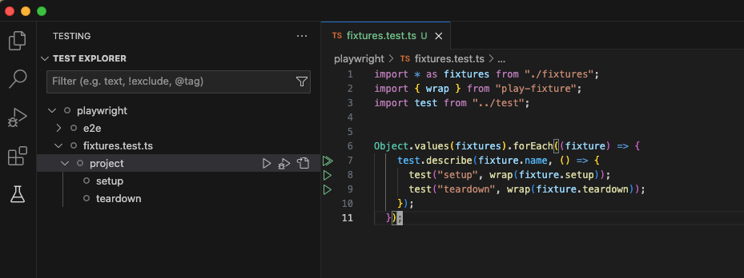

# play-fixture

Play with playwright fixtures.

## Description

This package converts [Playwright fixtures](https://playwright.dev/docs/test-fixtures) into playable tests. This allows for the following:

- Test setup and teardown of fixtures
- Separate setup and teardown of the same fixture
- Convenient setup and teardown of fixtures for other tests



fixtures are playable as tests in VSCode

## The Problem

Fixtures are a core concept in Playwright. They provide an encapsulated, reusable, lazy-loaded, and composable way of establishing an environment.

However, fixtures are not runnable on their own, so it can be inconvenient to focus on writing and testing fixtures.

This package provides a solution to the problem using some tricks. It's not perfect, but it's usable.

In addition, manually performing setup for testing can be tedious. This package enables you to reuse fixture setups and automate the process.

## Installation

```
npm install -D play-fixture
```

## Usage

There are several steps to use this package:

1. Create fixtures as ES modules.

   To create a fixture, create an ES module that exports the following named members:

   - `name`: The fixture name used in destructing params of tests.
   - `setup`: A function to set up the fixture values.
   - `teardown`: A function to tear down the fixture values.
   - `reserveOnFail`: Optional, boolean, defaults to `false`. If set to `true`, it will skip the teardown if some tests depend on the fixture and fail.

   Example:

   ```tsx
   // project.fixture.ts
   export const name = "project";

   export const setup = async ({ page }) => {
     // create project here
     const project = {
       // project info used by other tests
     };
     return { project }; // return value is passed to `use`, as fixture value
   };

   export const teardown = async ({ page, project }) => {
     // teardown for the project
     return {project: null}; // return new value for other uses
   };
   ```

   ```tsx
   export const name = "anotherFixture"

   export const setup = async ({page, project}) => {
    // setup another fixture here with project
    return {
      project,
      [name]: value
    }
   }

   export const teardown = async ({page, project}) => {
    // teardown for the fixture
    return {
      project,
      [name]: null
    }
   }
   ```

2. Extend Playwright tests with fixtures.

   use `testWithFixtures` to extend playwright test, and utilize the exported test in other tests:

   ```tsx
   // extended-test.ts
   import * as project from "./project.fixture";
   import { testWithFixtures } from "play-fixture";

   const test = testWithFixtures(fixtures);

   export default test;
   ```

   Optional `unserialize` and `serialize` functions can be used to recover or persist fixture values from storage.

    ```tsx
    // extended-test.ts
    import * as project from "./project.fixture";
    import { testWithFixtures } from "play-fixture";

    const test = testWithFixtures(fixtures, {
      unserialize: () => {
        // read value from file or database
        return value;
      },
      serialize: (value) => {
        // serialize fixture value to file or database
      },
    });

    export default test;
    ```

    This is for reusing a pre-existing fixture multiple times. If `unserialize` is provided and returns a truthy value, the `setup` process will be skipped in order to use the value from `unserialize`. `teardown` and `serialize` will also be skipped.

3. Convert the fixtures to tests in `fixtures.test.ts`.

   - To enable Playwright to discover tests, you need a test file. We use `fixtures.test.ts`.
   - To convert `setup` and `teardown` into tests, decorate them with `wrap`.

   Example:

   ```tsx
   // fixtures.test.ts
   import * as fixtures from "./fixtures";
   import { wrap } from "play-fixture";
   import test from "./extended-test";

   Object.values(fixtures).forEach((fixture) => {
     test.describe(fixture.name, () => {
       let currentValue;
       const callback = (v) => {
         // do something with the value
       };
       test("setup", wrap(fixture.setup, callback));
       test("teardown", wrap(fixture.teardown, callback));
     });
   });
   ```

   Here are some details about `wrap`:

   - It hides the return value from the test, which is expected to be `void`.
   - It keeps the destructing object signature of `setup` and `teardown`, which is required by Playwright to parse required fixtures.
   - You may pass a callback to do something the fixture value

4. Recommended: extend the Playwright configuration to enable only fixture tests in the VSCode extension.

   Since fixture tests are primarily for development and work best with the VSCode extension, it is recommended to enable them only for the VSCode Playwright extension.

   ```tsx
   // playwright.config.ts
   import type { PlaywrightTestConfig } from "@playwright/test";
   import { config as playFixtureConfig } from "play-fixture";

   const config: PlaywrightTestConfig = {
     // configurations
   };

   export default playFixtureConfig(config);
   ```

   This function append `testIgnore: "**/fixtures.{test,spec}.{ts,js,mjs}"` to playwright config when extension detected.
